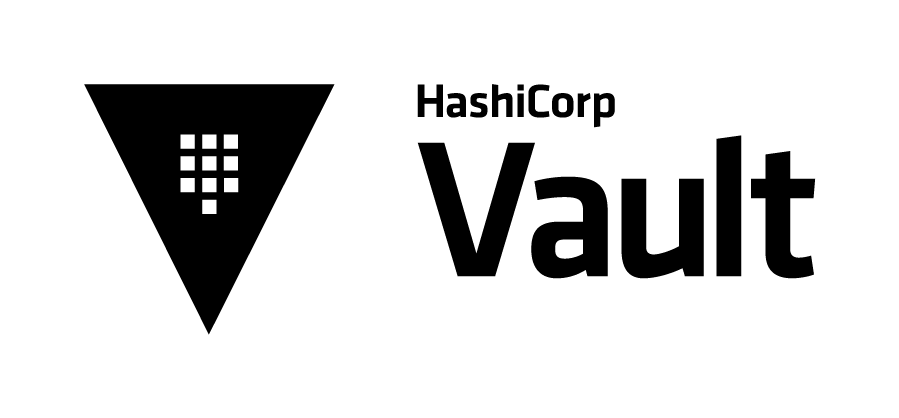

# Vault Reproductions

This repository is a vault (wink) of various scenarios I've worked with during my time as a Senior Support Engineer. The goal with this project is to share various scripts, guides, and reproductions for different Vault plugins. Some of these are based on real support cases or incidents, while others are smaller scripts to assist with learning Vault. 

I hope you find this repository helpful in your journey with Vault. 




## Start Here

If you are new to this repo, use this quick path:

1. Pick a category from [Available Docs](#available-docs) based on the issue type (`auth-*`, `secrets-*`, `kubernetes`, `seal-*`, `replication`, etc.).
2. Open the linked runbook/KB and complete the preconditions listed in that file before running commands.
3. Follow the validation and cleanup steps so your lab stays reproducible between runs.

Helpful external links:

- [Documentation](https://developer.hashicorp.com/vault/docs)
- [Tutorials](https://developer.hashicorp.com/vault/tutorials)
- [Certification exam](https://developer.hashicorp.com/certifications/security-automation)
- [Documentation source](https://github.com/hashicorp/web-unified-docs)

## Table of contents

- [Start Here](#start-here)
- [How to use this repository](#how-to-use-this-repository)
- [Prerequisites](#prerequisites)
- [Available Docs](#available-docs)
	- [Authentication Mounts](#authentication-mounts)
	- [Secrets Engines](#secrets-engines)
	- [Replication](#replication)
	- [Vault MCP Server](#vault-mcp-server)
	- [Vault Setup](#vault-setup)
	- [Seal / Unseal](#seal--unseal)
	- [Linux / Platform Behavior](#linux--platform-behavior)
	- [Kubernetes / Platform Behavior](#kubernetes--platform-behavior)
	- [Telemetry](#telemetry)
	- [System Backend - Vault (sys/)](#system-backend---vault-sys)
	- [Vault Associate Exam Prep](#vault-associate-exam-prep)
	- [Vault Professional Exam Prep](#vault-professional-exam-prep)
- [TODO / Roadmap](#todo--roadmap)

## How to use this repository

1. Locate the relevant scenario category in [Available Docs](#available-docs).
2. Choose a runbook (`*.md`) for walkthroughs or a script (`*.sh`) for setup automation.
3. Run commands exactly as written, then confirm expected output in each Validation section.
4. Run cleanup steps before starting another scenario to avoid state carryover.

## Prerequisites

Most scenarios use this baseline local lab setup:

- `kubectl`, `helm`, `minikube`
- Docker (`Docker Desktop` or Docker Engine)
- `jq`

Common optional tools (scenario-dependent):

- `gpg`
- `unzip` and `wget`/`curl`
- `ldapsearch` and `nc`
- `psql`
- `sqlplus`

### Quick install (Homebrew)

```bash
brew install jq kubectl helm minikube gnupg wget
```

If you do not use Homebrew, install equivalent packages with your OS package manager.

## Available Docs

### Authentication Mounts

####  Userpass

- [Userpass Entity Metadata Dynamic Policy Repro](auth-userpass/userpass-entity-metadata-dynamic-policy-repro.md)
	- Local reproduction for dynamic policy templating using entity metadata.
	- Demonstrates immediate access changes on active tokens when entity metadata changes.

- [Userpass Authentication Setup Script](auth-userpass/userpass-authentication-setup.sh)
	- Enables userpass auth, creates test users, and validates login/token behavior.
	- Useful for observing identity handling when many local auth users are created and used.
	- Includes behavior validation related to entities and aliases.

####  Kubernetes

- [Kubernetes Auth User Creation and Login Script](auth-kubernetes/create-kubernetes-users-and-login.sh)
	- Creates Kubernetes service accounts, configures Vault Kubernetes auth, and tests login flow.
	- Useful for evaluating how Vault creates and maps identities during Kubernetes auth.
	- Includes behavior validation related to entities and aliases.

####  JWT

- [JWT Authentication Setup and Login Script](auth-jwt/jwt-authentication-setup-and-login.sh)
	- Configures Vault JWT auth with a local RSA key pair and issuer binding.
	- Creates per-user JWT roles, signs demo JWTs, and validates login for each configured user.
	- Optionally creates and reads a KV v2 demo secret to confirm post-login policy access.

- [JWT Bound Claims Glob Runbook](auth-jwt/jwt-bound-claims-glob-runbook.md)
	- Reproduces JWT claim validation failures for nested namespace paths when `bound_claims_type` uses exact string matching.
	- Demonstrates the fix with `bound_claims_type="glob"` and wildcard `namespace_path` patterns.
	- Includes case-sensitivity checks, token-claim decoding, and cleanup commands.

####  LDAP

- [OpenLDAP LDAP Auth Reproduction](auth-ldap/openldap-ldap-auth-repro.md)
	- End-to-end OpenLDAP + Vault LDAP auth runbook with Docker-hosted LDAP and Kubernetes-hosted Vault.
	- Includes generation of 200 sample users, group mapping tests, and nested-group inheritance behavior checks.

####  Token

- [Token Role `allowed_policies` vs `allowed_policies_glob` KB](auth-token/token-role-allowed-policies-glob-kb.md)
	- Covers token role failures where requested token policies are not a subset of `allowed_policies` or `allowed_policies_glob`.
	- Clarifies that token roles support glob patterns (not regex) and includes practical examples.

### Secrets Engines

####  Artifactory

- [Artifactory Plugin Registration Script](secrets-artifactory/artifactory-plugin-registration.sh)
	- Amazon Linux setup script for Vault Enterprise + JFrog Artifactory secrets plugin registration.
	- Includes plugin checksum validation and flattened plugin directory layout to avoid execution path errors.

####  LDAP

- [LDAP Secrets Engine Setup Repro](secrets-ldap/setup-ldap-secrets-engine-repro.md)
	- OpenLDAP + Vault LDAP secrets engine setup focused on bind account and static-role password rotation timing.
	- Uses [secrets-ldap/openldap-deployment.yaml](secrets-ldap/openldap-deployment.yaml) as the backing Kubernetes manifest.

####  Oracle Database

- [Oracle Database Plugin Setup](secrets-oracle-db/oracle-database-plugin-setup.md)
	- Rapid Oracle environment setup for testing Vault database plugin behavior with dynamic and static credentials.

####  PKI (CMPv2)

- [CMPv2 PKI Integration Guide](secrets-pki-cmpv2/cmpv2-pki-integration-guide.md)
	- Markdown-only runbook for Vault PKI CMPv2 integration and proxy behavior validation.
	- Includes concrete expected output blocks from a successful direct + proxied CMP IR repro.

####  RabbitMQ

- [RabbitMQ Secrets Engine Repro](secrets-rabbitmq-db/rabbitmq-secrets-engine-repro.md)
	- Simple RabbitMQ + Vault secrets engine runbook for dynamic credential issuance and lease revocation validation.
	- Assumes an already-operational Vault cluster in Kubernetes and uses a local RabbitMQ container for testing.

####  AWS

- [AWS Secrets Engine Upgrade Findings KB](secrets-aws/aws-secrets-engine-upgrade-findings-kb.md)
	- Discusses real-life errors faced by enterprise customers found in v1.19.x for `sts_endpoint`, `iam_endpoint`, and rotation schedule/window(s).

####  KV

- [KV v1 Secret Recovery Runbook](secrets-kv/kv-v1-secret-recovery-runbook.md)
	- Step-by-step reproduction for Vault Enterprise secret recovery using a loaded Raft snapshot.
	- Covers secret deletion/overwrite simulation, snapshot load status checks, `vault recover`, and cleanup.

- [KV v2 Soft-Delete, Destroy, Undelete, and Recovery Runbook](secrets-kv/kv-v2-soft-delete-destroy-undelete-recovery-runbook.md)
	- Step-by-step lifecycle validation for KV v2 versioned secrets.
	- Covers soft-delete, undelete, permanent destroy behavior, optional metadata delete, and cleanup.

- [KV Path Migration Runbook (Same Mount)](secrets-kv/kv-path-migration-runbook.md)
	- Instructions on how to copy a folder subtree and all secrets to a new path within the same KV mount.
	- Includes a recursive script, dry-run mode, validation checks, and cleanup guidance.
	- Clarifies when to use replication/snapshots versus manual copy and notes metadata/version-history limitations.

####  TOTP

- [TOTP Secrets Engine Repro](secrets-totp/totp-secrets-engine-repro.md)
	- Reproduction runbook for the Vault TOTP secrets engine, including setup and validation flow.

####  Snowflake Database

- [AppRole + Snowflake Database Secrets Engine Repro](secrets-snowflake-db/approle-snowflake-db-reproduction.md)
	- End-to-end setup for Vault database secrets engine with Snowflake using RSA key-pair authentication and static role rotation.
	- Covers Snowflake service account creation, AppRole auth configuration, credential rotation verification, and optional SnowSQL connection validation.

####  PostgreSQL Database

- [PostgreSQL Database Secrets Engine Repro](secrets-postgresql-db/postgresql-database-secrets-engine-repro.md)
	- PostgreSQL + Vault database secrets engine setup covering dynamic credentials, static role rotation, and custom password policies.
	- Useful for validating credential lifecycle, lease revocation, and rotation timing behavior.

- [PostgreSQL Static Role Denial of Service Repro](secrets-postgresql-db/postgresql-static-role-denial-of-service-repro.md)
	- Reproduces static role rotation pressure when the backing PostgreSQL target is unavailable or decommissioned.
	- Useful for incident response drills and understanding cleanup/recovery patterns for stale static roles.

### Replication

- [Vault Enterprise Replication Runbook (PR + DR)](replication/vault-enterprise-replication-pr-dr-runbook.md)
	- Troubleshooting guide for already-configured Performance Replication and Disaster Recovery replication clusters.
	- Covers merkle sync/diff issues, failover/failback commands, and merkle corruption remediations.

- [Merkle Corruption Reindex KB](replication/vault-replication-merkle-corruption-reindex-kb.md)
	- KB for resolving PR/DR replication stuck in `merkle-diff`/`merkle-sync` due to corrupted primary merkle trees.
	- Covers primary-first reindex strategy, write-lock expectations, validation checkpoints, and rollback cautions.

### Vault MCP Server

- [Vault MCP Server Setup](vault-mcp-server/vault-mcp-server-setup.md)
	- Connects `vault-mcp-server` to an existing Kubernetes Vault cluster via port-forward.
	- Covers binary install, policy and token creation, and VS Code / Claude Desktop MCP client configuration.
	- Includes a policy file scoped to KV v2, mount management, and PKI operations.

### Vault Setup

- [Vault Cluster Init Script](setup/init.sh)
	- Installs Vault via Helm (HA + Raft, 3 pods), initializes with 5 total key shares and threshold 3, saves init output to `setup/init.json`, unseals all nodes, and logs into `vault-0` with the root token.

- [Vault PGP Key Setup Script](setup/setup-pgp-keys-for-vault.sh)
	- Generates PGP key pairs, copies public keys into the Vault pod, and runs `vault operator init` with PGP-encrypted unseal keys. Targets `vault-0` in namespace `vault` (configurable).

- [Vault Encryption Key Rotation + Rekey Runbook](setup/vault-encryption-key-rotation-and-rekey-runbook.md)
	- Step-by-step runbook for rotating the Vault encryption key term (`sys/rotate`) and rekeying Shamir unseal shares (`vault operator rekey`).
	- Includes least-privilege policy example, command syntax gotchas, and post-change validation checks.

- [Vault Sandbox Cleanup Script](setup/cleanup.sh)
	- Cleans up sandbox state between runs: uninstalls the Vault Helm release, deletes the `vault` namespace, deletes the Minikube `vault` profile, and removes `setup/init.json`.

### Seal / Unseal

- [Transit Auto-Unseal Runbook](seal-transit/transit-auto-unseal-runbook.md)
	- Local reproduction for Vault transit-based auto-unseal using two dev servers (transit + auto-unseal).
	- Includes a mock HCL config file (`vault-transit-auto-unseal.hcl`) and step-by-step startup, init, restart, and validation flow.

- [KB: Circular Transit Auto-Unseal Dependency (Double Transit)](seal-transit/double-transit-autounseal-dependency-kb.md)
	- Documents a support case where two Vault clusters were configured to transit-unseal each other.

- [AWS KMS Auto-Unseal Runbook (EC2 + Vault Enterprise)](seal-awskms/awskms-auto-unseal-runbook.md)
	- Single-node EC2 (Amazon Linux 2023) setup for Vault Enterprise with `awskms` seal and `raft` storage.
	- Includes license setup, systemd service configuration, restart validation, and cleanup guidance.

- [Azure Key Vault Auto-Unseal Runbook (Linux VM + Vault Enterprise)](seal-azure/azurekeyvault-auto-unseal-runbook.md)
	- Single-node Azure Ubuntu 22.04 VM setup for Vault Enterprise with `azurekeyvault` seal and `raft` storage.
	- Covers App Registration creation, client secret generation, Key Vault Crypto User role assignment, and seal stanza configuration.

### Linux / Platform Behavior

- [Vault Logrotate KB](linux/vault-logrotate-kb.md)
	- Practical Linux/systemd-focused guidance for Vault logrotate configuration and troubleshooting.
	- Includes directive-by-directive explanations, safer rotation recommendations, and validation steps.

### Kubernetes / Platform Behavior

####  Vault Core on Kubernetes

- [Liveness Probe KB](kubernetes/liveness-probe-kb.md)
	- Demonstrates automatic Vault pod recovery when TLS certificates expire, using Kubernetes liveness probes.

- [Vault Raft Quorum Break and Restore Runbook](kubernetes/vault-raft-quorum-break-and-restore-runbook.md)
	- Reproduces quorum-loss by scaling a Vault StatefulSet down to one pod, then restores service with single-node raft peer recovery and scale-out validation.

####  Proxy TLS Behavior

- [Vault Proxy TLS Behavior Repro](kubernetes/proxy-tls-behavior/vault-proxy-tls-behavior-repro.md)
	- Reproduces HTTP client traffic into a local proxy with TLS-only Vault upstream.
	- Validates that Vault can stay TLS-only while a front proxy handles plaintext listener and HTTPS re-encryption.

####  Vault Secrets Operator (VSO)

- [VSO Kubernetes Auth Static and Dynamic Repro](kubernetes/vso-k8s-auth-static-dynamic/vso-k8s-auth-static-dynamic-repro.md)
	- Reproduces Vault Secrets Operator sync flows for static KV v2 secrets and dynamic database credentials using Vault Kubernetes authentication.
	- Includes policy and role setup, secret rotation verification, and failure injection by breaking/restoring Kubernetes auth role bindings.

- [VSO Special Character Secret Keys KB](kubernetes/vso-special-character-secret-keys-kb.md)
	- Documents VSO sync failures when KV keys include Kubernetes-invalid characters such as `@`.
	- Includes a runnable repro, expected vs observed behavior, and workaround/architecture guidance.

- [VSO AKS UDP DNS Race KB](kubernetes/vso-aks-udp-dns-race-kb.md)
	- Documents intermittent VSO DNS timeout failures in AKS (`read udp ... :53: i/o timeout`) after initial successful reconciles. This was a customer incident where all application pods lost connectivity to Vault after a certain period of time, and the root cause was traced back to VSO DNS timeouts due to AKS UDP conntrack behavior.
	- Covers UDP conntrack race hypothesis, validation commands, and mitigations (LocalDNS and/or shorter refresh intervals).

### Telemetry

- [Vault Telemetry Grafana Repro](telemetry/vault-telemetry-grafana-repro.md)
	- Configures Vault telemetry with Prometheus scraping and a local Grafana dashboard using `kube-prometheus-stack`.
	- Includes end-to-end setup and validation steps for metrics targets, Prometheus queries, and Grafana access.

### System Backend - Vault (sys/)

- [Sentinel EGP and RGP Governing Policies KB](sys-policies/sentinel-egp-rgp-governing-policies-kb.md)
	- Break-fix KB for understanding and validating Sentinel Endpoint Governing Policies (EGP) and Role Governing Policies (RGP).
	- Includes practical policy examples, denial signatures, and validation/cleanup commands.

### Vault Associate Exam Prep

- [Vault Associate Exam Guide](vault-associate-cert/vault-associate-exam-guide.md)
	- Guide covering the Vault Associate Exam: format, rubric, and external resources.

### Vault Professional Exam Prep

- [Vault Professional Exam Guide](vault-professional-cert/vault-professional-exam-guide.md)
	- Guide covering the Vault Professional Exam: format, rubric, and lab scenarios.

	- [Lab 1: Transit Auto-Unseal and Node Join](vault-professional-cert/lab-01-transit-auto-unseal-and-node-join.md)
		- Hands-on runbook for configuring a transit-backed auto-unseal flow and joining a node to a cluster.

	- [Lab 2: AppRole + response wrapping + database secrets engine](vault-professional-cert/lab-02-approle-wrapping-and-postgresql.md)
		- Hands-on runbook for AppRole login with wrapped `secret_id`, JSON output capture, and PostgreSQL dynamic credentials validation.

	- [Lab 3: Vault Agent + AppRole auto-auth + templating](vault-professional-cert/lab-03-vault-agent-approle-templating.md)
		- Hands-on runbook for configuring Vault Agent with AppRole auto-auth, validating `secret_id` retention, and rendering a template with dynamic KV v2 secrets.
		
	- [Lab 4: Performance replication with path filtering](vault-professional-cert/lab-04-pr-replication-path-filtering.md)
		- Practical PR setup and verification flow focused on primary/secondary behavior and path filter validation.

	- [Lab 5: Policies, namespaces, and KV v2 operations](vault-professional-cert/lab-05-policy-kvv2-namespaces.md)
		- Traditional runbook to practice namespace-aware login context, policy inheritance boundaries, and KV v2 path precision tests.


## TODO / Roadmap

Planned runbooks and KBs are tracked in [TODO.md](TODO.md). Refactoring some of the runbooks to be used in GitHub Codespaces.