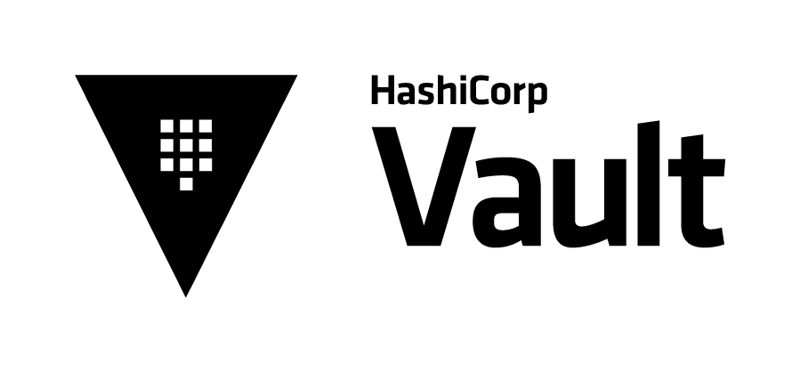

# Vault Reproductions

This repository is a vault (wink) of various scenarios I've worked with during my time as a Software Engineer on Vault. The goal with this project is to share various scripts, guides, and reproductions for different Vault integrations. Some of these are created from real escalations and incidents, while others are smaller scripts to assist with learning Vault. 

I hope you find this repository helpful in your journey with Vault.

----

## Start Here

If you are new to this repo, pick one path:

1. Version-specific defect: open [KNOWN_BUGS.md](KNOWN_BUGS.md) and match the error or Vault version.
2. Topic lookup: open the folder README for the issue type, then the linked runbook, KB, repro, guide, or script.
3. Complete the preconditions in that file before running commands, and follow its validation and cleanup steps so the lab stays reproducible between runs.

Topic indexes:

- [AI](ai/README.md) — IBM Bob, Vault MCP server
- [Auth](auth/README.md) — AWS, JWT, Kubernetes, LDAP, token, userpass, etc.
- [Certification](certification/README.md) — Associate and Professional exam labs
- [Kubernetes](kubernetes/README.md) — CSI, VSO, probes, Raft quorum
- [Linux](linux/README.md) — logrotate, etc.
- [Secrets](secrets/README.md) — database, KV, LDAP, PKI, transit, TOTP, AWS, Artifactory, etc.
- [Setup](setup/README.md) — local Kubernetes cluster init and cleanup
- [System Backend](sys/README.md) — health, policies, plugins, raft, replication, seal, sync, SCIM, UI, etc.
- [Telemetry](telemetry/README.md) — Prometheus and Grafana

Helpful Vault external links:

- [Vault Official Documentation](https://developer.hashicorp.com/vault/docs)
- [Vault Tutorials](https://developer.hashicorp.com/vault/tutorials)
- [Vault Certification Exams](https://developer.hashicorp.com/certifications/security-automation)
- [Documentation source](https://github.com/hashicorp/web-unified-docs)
- [Vault OSS Repository](https://github.com/hashicorp/vault)
- [Vault Enterprise Repository](https://github.com/hashicorp/vault-enterprise)

----

## Prerequisites

Most scenarios use this baseline local lab setup:

- `kubectl`, `helm`, `minikube`
- Docker (`Docker Desktop` or Docker Engine)
- `jq`

Common optional tools (scenario-dependent):

- `gpg`
- `unzip` and `wget`/`curl`
- `ldapsearch` and `nc`
- `psql`
- `sqlplus`

----

## Known Bugs & Regressions

Confirmed Vault, Terraform Vault provider, and library defects with version ranges are in [KNOWN_BUGS.md](KNOWN_BUGS.md). Start there when the question is whether a specific release has a documented bug.
