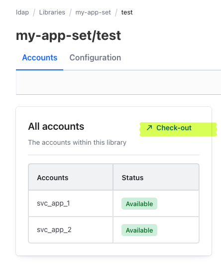
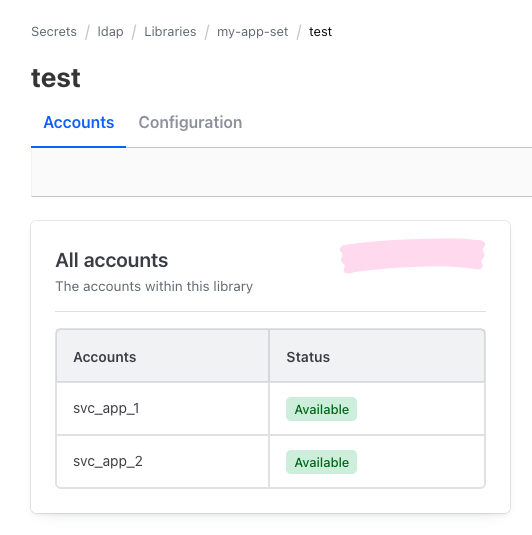

# LDAP Secrets Engine - UI Capabilities Self Bug Reproduction

This reproduction demonstrates a UI bug/regression in Vault spanning versions `1.20.7` through `1.20.10` and `1.21.5` where the `check-out` context action is missing from the Web UI for an LDAP Library Set. The issue prevents properly scoped users from initiating a checkout via the browser GUI. It acts normally in `1.20.4` and in `2.0.0`.

## Impacted Versions
- 1.20.7 - 1.20.10
- 1.21.5

## Working Versions
- 1.20.4
- 2.0.0

## Environment Setup

### 1. Spin up the OpenLDAP container

```bash
docker run -d \
    --name my-openldap-container \
    -p 389:389 \
    -e LDAP_DOMAIN="example.org" \
    -e LDAP_ADMIN_PASSWORD='SuperSecretPassword!' \
    osixia/openldap:latest
```

### 2. Seed the OpenLDAP container

Vault actively queries OpenLDAP when writing Library Sets to verify the base DN and users exist. Be sure to inject these identities. 

```bash
cat << 'INNER_EOF' > bootstrap.ldif
dn: ou=service-accounts,dc=example,dc=org
objectClass: organizationalUnit
ou: service-accounts

dn: cn=svc_app_1,ou=service-accounts,dc=example,dc=org
objectClass: inetOrgPerson
cn: svc_app_1
sn: Service App 1
uid: svc_app_1
userPassword: password1

dn: cn=svc_app_2,ou=service-accounts,dc=example,dc=org
objectClass: inetOrgPerson
cn: svc_app_2
sn: Service App 2
uid: svc_app_2
userPassword: password2
INNER_EOF

docker exec -i my-openldap-container ldapadd -x -D "cn=admin,dc=example,dc=org" -w 'SuperSecretPassword!' < bootstrap.ldif
```

### 3. Enable and Configure the Secrets Engine

```bash
# Enable the LDAP secrets engine
vault secrets enable ldap

# Configure the LDAP connection
vault write ldap/config \
    binddn="cn=admin,dc=example,dc=org" \
    bindpass='SuperSecretPassword!' \
    url="ldap://host.docker.internal:389" \
    userdn="ou=service-accounts,dc=example,dc=org"

# Create a set of service accounts to be checked out
vault write ldap/library/my-app-set/test \
    service_account_names="svc_app_1, svc_app_2" \
    ttl=2h \
    max_ttl=8h
```

## Reproduction Steps

### 1. Create a Test Policy

Write a restricted capabilities policy intended to give read, check-in, and check-out access to the newly mounted LDAP library set.

```bash
cat << 'INNER_EOF' > /tmp/ldap.hcl
path "ldap/*" {
    capabilities = ["list"]
}
path "ldap/library/my-app-set/test" {
    capabilities = ["read", "update"]
}
path "ldap/library/my-app-set/test/status" {
    capabilities = ["read"]
}
path "ldap/library/my-app-set/test/check-in" {
    capabilities = ["read", "update"]
}
path "ldap/library/my-app-set/test/check-out" {
    capabilities = ["read", "update"]
}
INNER_EOF

vault policy write ldap /tmp/ldap.hcl
```

### 2. Generate a Token

Create a standard token with the scoped LDAP policy attached to act as a simulated user.

```bash
vault token create -policy=ldap
```
_Record the `token` from the output value to log into the UI._

### 3. Log in to the Vault UI 

Using the newly provisioned token, log into the Vault UI and navigate to the mounted path: 

`Secrets -> ldap -> library -> my-app-set -> test`

Observe the allowed capabilities and actionable buttons inside the user checkout screen as presented below.

### Vault 1.20.4 & 2.0.0 (Working Properly)
In the earlier baseline version, the user clearly sees the actionable `check-out` function within the Library Set detail UI.



### Vault 1.21.5 (Bug Introduced / Reproducible)
In intermediate patch sets bridging `1.20.7-1.20.10` and `1.21.5`, the UI incorrectly filters the permissions, failing to render the `check-out` options, thus obscuring the functionality entirely from the browser view.

