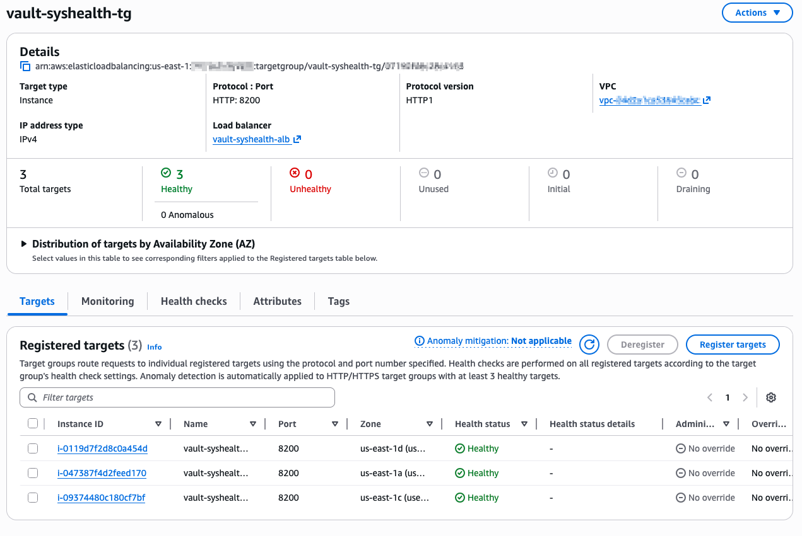
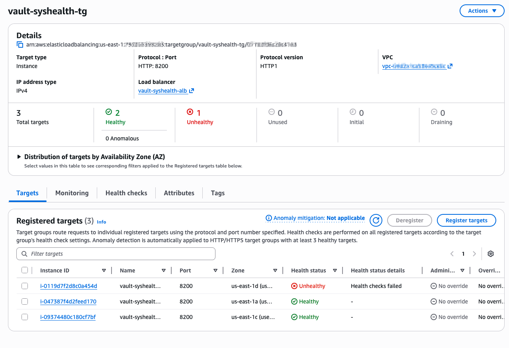
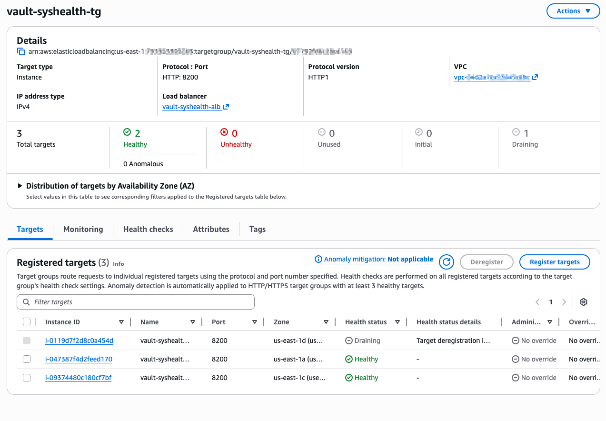
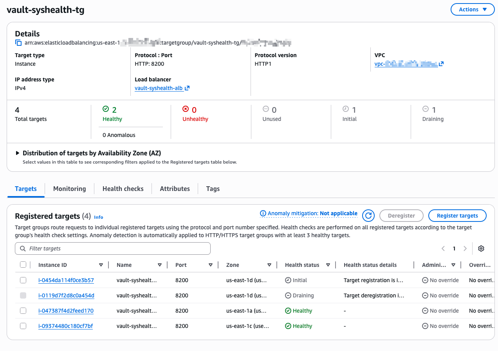

# AWS Auto Scaling Runbook for Vault `sys/health`

## Objective

Create an AWS Auto Scaling Group (ASG) that uses Application Load Balancer (ALB) target group health checks against Vault `sys/health` so unhealthy Vault nodes are removed and replaced automatically.

This runbook is intended for lab/sandbox environments.

## Prerequisites

- AWS CLI v2 
- Logged in with AWS credentials that have permissions to create and manage:
  - Load balancers and target groups
  - Auto Scaling groups
  - EC2 launch templates and instances
- The `vault-enterprise` repository cloned locally (to deploy EC2 instances via ENOS)

## Deploy a Vault Cluster with Enos to AWS

We are going to deploy a 3 node cluster via Enos and then use an ASG to manage the cluster. 

Set these variables in enos-local.vars.hcl:

```hcl
// aws_region is the AWS region where we'll create infrastructure
// for the smoke scenario
aws_region = "us-east-1"

// aws_ssh_keypair_name is the AWS keypair to use for SSH
aws_ssh_keypair_name = "key-pair-name"

// aws_ssh_private_key_path is the path to the AWS keypair private key
aws_ssh_private_key_path = "/path/to/.ssh/key-pair-name.pem"

// vault_instance_type is the instance type to use for the Vault backend
vault_instance_type = "t3.small"

// vault_instance_count is how many instances to create for the Vault cluster.
vault_instance_count = 3

// vault_license_path is the path to a valid Vault enterprise edition license.
// This is only required for non-ce editions"
vault_license_path = "/path/to/vault.hclic"

// vault_log_level is the server log level for Vault logs. Supported values (in order of detail) are
// trace, debug, info, warn, and err."
vault_log_level = "trace"

// vault_product_version is the version of Vault we are testing. Some validations will expect the vault
// binary and cluster to report this version.
vault_product_version = "1.21.5"
```

Deploy the cluster with Enos:

```bash
enos scenario launch dev_single_cluster artifact:zip backend:raft distro:amzn edition:ent seal:awskms arch:amd64
```

```text
Enos operations finished! 🐵

Scenario: dev_single_cluster [arch:amd64 artifact:zip backend:raft distro:amzn edition:ent seal:awskms] ✅
```

## Vault Health Endpoint Design

For ALB health checks, use this path:

```text
/v1/sys/health?standbyok=true&perfstandbyok=true&sealedcode=503&uninitcode=503
```

For Enos-created clusters that use `tls_disable = "true"` in the Vault listener, use `HTTP` for the target group protocol and the ALB health check protocol. Do not use `HTTPS` unless Vault itself is serving TLS on port `8200`.

Why this works:

- Active node returns `200`.
- Standby and performance standby return `200` because of `standbyok=true` and `perfstandbyok=true`.
- Sealed/uninitialized nodes return `503` and are marked unhealthy.

## Lab Variables

Set reusable variables before running the commands.

```bash
export TG_NAME="vault-syshealth-tg"
export ALB_NAME="vault-syshealth-alb"
export LISTENER_PORT="8200"
export LT_NAME="vault-syshealth-lt"
export ASG_NAME="vault-syshealth-asg"
export MIN_SIZE="0"
export MAX_SIZE="3"
export DESIRED_CAPACITY="0"
export VAULT_VERSION="1.21.5"
```

Set region and project tag first.

```bash
export AWS_REGION="us-east-1"
export PROJECT_TAG_VALUE="vault-enos-integration"
export VAULT_LICENSE_B64="$(printf '%s' "$VAULT_LICENSE" | base64 | tr -d '\n')"
```

Find running Vault instance IDs by tag.

```bash
export INSTANCE_IDS="$(aws ec2 describe-instances \
  --region "$AWS_REGION" \
  --filters "Name=tag:Project Name,Values=$PROJECT_TAG_VALUE" "Name=instance-state-name,Values=running" \
  --query 'Reservations[].Instances[].InstanceId' \
  --output text)"

echo "$INSTANCE_IDS"
```

Expected result:

```text
Three running instance IDs are returned (or however many Vault nodes are in the cluster).
```

Derive core networking and instance values from those tagged instances (zsh-safe).

```bash
export VPC_ID="$(aws ec2 describe-instances \
  --region "$AWS_REGION" \
  --filters "Name=tag:Project Name,Values=$PROJECT_TAG_VALUE" "Name=instance-state-name,Values=running" \
  --query 'Reservations[0].Instances[0].VpcId' \
  --output text)"

export SUBNET_IDS="$(aws ec2 describe-instances \
  --region "$AWS_REGION" \
  --filters "Name=tag:Project Name,Values=$PROJECT_TAG_VALUE" "Name=instance-state-name,Values=running" \
  --query 'Reservations[].Instances[].SubnetId' \
  --output text | tr '\t' '\n' | sort -u | paste -sd, -)"

export VAULT_INSTANCE_SG_ID="$(aws ec2 describe-instances \
  --region "$AWS_REGION" \
  --filters "Name=tag:Project Name,Values=$PROJECT_TAG_VALUE" "Name=instance-state-name,Values=running" \
  --query 'Reservations[].Instances[].SecurityGroups[].GroupId' \
  --output text | tr '\t' '\n' | sort -u | head -n1)"

export AMI_ID="$(aws ec2 describe-instances \
  --region "$AWS_REGION" \
  --filters "Name=tag:Project Name,Values=$PROJECT_TAG_VALUE" "Name=instance-state-name,Values=running" \
  --query 'Reservations[0].Instances[0].ImageId' \
  --output text)"

export INSTANCE_TYPE="$(aws ec2 describe-instances \
  --region "$AWS_REGION" \
  --filters "Name=tag:Project Name,Values=$PROJECT_TAG_VALUE" "Name=instance-state-name,Values=running" \
  --query 'Reservations[0].Instances[0].InstanceType' \
  --output text)"

export KEY_NAME="$(aws ec2 describe-instances \
  --region "$AWS_REGION" \
  --filters "Name=tag:Project Name,Values=$PROJECT_TAG_VALUE" "Name=instance-state-name,Values=running" \
  --query 'Reservations[0].Instances[0].KeyName' \
  --output text)"

export IAM_INSTANCE_PROFILE_ARN="$(aws ec2 describe-instances \
  --region "$AWS_REGION" \
  --filters "Name=tag:Project Name,Values=$PROJECT_TAG_VALUE" "Name=instance-state-name,Values=running" \
  --query 'Reservations[0].Instances[0].IamInstanceProfile.Arn' \
  --output text)"

export IAM_INSTANCE_PROFILE_NAME="${IAM_INSTANCE_PROFILE_ARN##*/}"

printf 'VPC_ID=%s\nSUBNET_IDS=%s\nVAULT_INSTANCE_SG_ID=%s\nAMI_ID=%s\nINSTANCE_TYPE=%s\nKEY_NAME=%s\nIAM_INSTANCE_PROFILE_NAME=%s\n' \
  "$VPC_ID" "$SUBNET_IDS" "$VAULT_INSTANCE_SG_ID" "$AMI_ID" "$INSTANCE_TYPE" "$KEY_NAME" "$IAM_INSTANCE_PROFILE_NAME"
```

Expected result:

```text
You should see the VPC ID, comma-separated subnet IDs, Vault instance security group ID, base AMI ID, instance type, SSH key name, and IAM instance profile name printed without error.
```

If you have the local Enos run directory, derive the dynamic Vault cluster values from Terraform outputs instead of hardcoding them.

```bash
export ENOS_STATE_ROOT="/path/to/vault-enterprise/enos/.enos"
export ENOS_RUN_DIR="$(find "$ENOS_STATE_ROOT" -mindepth 1 -maxdepth 1 -type d -exec stat -f '%m %N' {} \; | sort -nr | head -n1 | cut -d' ' -f2-)"

echo "$ENOS_RUN_DIR"

export ENOS_CLUSTER_NAME="$(terraform -chdir="$ENOS_RUN_DIR" output -raw cluster_name)"
export ENOS_KMS_KEY_ID="$(terraform -chdir="$ENOS_RUN_DIR" output -json seal_key_attributes | jq -r '.kms_key_id')"
export ENOS_CLUSTER_TAG_KEY="vault-cluster"
export VAULT_LOG_LEVEL="trace"

printf 'ENOS_CLUSTER_NAME=%s\nENOS_KMS_KEY_ID=%s\nENOS_CLUSTER_TAG_KEY=%s\nVAULT_LOG_LEVEL=%s\n' \
  "$ENOS_CLUSTER_NAME" "$ENOS_KMS_KEY_ID" "$ENOS_CLUSTER_TAG_KEY" "$VAULT_LOG_LEVEL"
```

Expected result:

```text
You should see the Enos cluster name, KMS key ID, cluster tag key, and Vault log level printed without error.
```

Create an ALB security group in the same VPC if you do not already have one.

```bash
export ALB_SG_ID="$(aws ec2 create-security-group \
  --group-name "vault-syshealth-alb-sg" \
  --description "ALB security group for Vault sys-health checks" \
  --vpc-id "$VPC_ID" \
  --region "$AWS_REGION" \
  --query 'GroupId' \
  --output text)"

echo "$ALB_SG_ID"
```

Allow inbound traffic to ALB listener port and allow ALB to reach Vault on 8200.

```bash
aws ec2 authorize-security-group-ingress \
  --group-id "$ALB_SG_ID" \
  --ip-permissions IpProtocol=tcp,FromPort=8200,ToPort=8200,IpRanges='[{CidrIp=0.0.0.0/0,Description="ALB listener access"}]' \
  --region "$AWS_REGION"

aws ec2 authorize-security-group-ingress \
  --group-id "$VAULT_INSTANCE_SG_ID" \
  --ip-permissions IpProtocol=tcp,FromPort=8200,ToPort=8200,UserIdGroupPairs='[{GroupId='"$ALB_SG_ID"',Description="Allow ALB to Vault 8200"}]' \
  --region "$AWS_REGION"
```

Expected result:

```text
Ingress rules are added for ALB listener traffic and ALB-to-Vault health checks.
```

## Step 1: Create the Target Group with `sys/health` Checks

Create an instance target group that checks Vault health directly.

If you receive `Value '' at 'targetGroupName'`, `TG_NAME` is empty in your current shell. Re-export the lab variables and rerun the preflight check above before creating the target group.

```bash
export TG_ARN="$(aws elbv2 create-target-group \
  --name "$TG_NAME" \
  --protocol HTTP \
  --port 8200 \
  --vpc-id "$VPC_ID" \
  --target-type instance \
  --health-check-protocol HTTP \
  --health-check-port traffic-port \
  --health-check-path '/v1/sys/health?standbyok=true&perfstandbyok=true&sealedcode=503&uninitcode=503' \
  --matcher HttpCode=200 \
  --health-check-interval-seconds 10 \
  --health-check-timeout-seconds 5 \
  --healthy-threshold-count 2 \
  --unhealthy-threshold-count 2 \
  --region "$AWS_REGION" \
  --query 'TargetGroups[0].TargetGroupArn' \
  --output text)"

echo "$TG_ARN"
```

Expected result:

```text
Target group ARN
```

## Step 2: Create ALB and Listener

Create an internal or internet-facing ALB (example below uses internet-facing).

```bash
subnet_args=(${(s:,:)SUBNET_IDS})

export ALB_ARN="$(aws elbv2 create-load-balancer \
  --name "$ALB_NAME" \
  --subnets "${subnet_args[@]}" \
  --security-groups "$ALB_SG_ID" \
  --scheme internet-facing \
  --type application \
  --ip-address-type ipv4 \
  --region "$AWS_REGION" \
  --query 'LoadBalancers[0].LoadBalancerArn' \
  --output text)"

echo "$ALB_ARN"
```

```
ALB ARN
```

Create a listener that forwards traffic to the target group.

```bash
export LISTENER_ARN="$(aws elbv2 create-listener \
  --load-balancer-arn "$ALB_ARN" \
  --protocol HTTP \
  --port "$LISTENER_PORT" \
  --default-actions Type=forward,TargetGroupArn="$TG_ARN" \
  --region "$AWS_REGION" \
  --query 'Listeners[0].ListenerArn' \
  --output text)"

echo "$LISTENER_ARN"
```

Expected result:

```text
Listener ARN
```

## Step 3: Create a Launch Template

If you already have a launch template for Vault instances, skip this step and set `LT_ID`/`LT_VERSION` from the existing template.

Create a launch template that can produce a fully functional replacement Vault node.

Vault requirement:

- The replacement node must start Vault with the same storage and listener configuration as the existing cluster.
- If you use integrated storage, configure `retry_join` and whatever auto-unseal method your lab uses so a newly launched instance can join without manual recovery work.
- Prefer a fresh base AMI plus user data that installs and configures Vault. Do not create the launch template from a live Raft node image unless you fully sanitize the image first.

Use the base image from the existing Enos nodes and install Vault during first boot.

This avoids copying `/opt/raft/data` from a live node into replacement instances.

Before continuing, confirm the base image really is a clean distro image and not a previously customized Vault image.

```bash
printf 'AMI_ID=%s\nVAULT_VERSION=%s\n' "$AMI_ID" "$VAULT_VERSION"
```

Expected result:

```text
AMI_ID=ami-<id> (should be a clean distro image, not a Vault image)
VAULT_VERSION=1.21.5
```

Create user data that installs Vault Enterprise, writes the configuration on boot, and starts with an empty Raft data directory.

This lab shortcut embeds the Vault license from your current shell into launch-template user data. That is acceptable for short-lived internal labs, but do not use this pattern in production because user data can be retrieved from EC2 metadata and the launch template.

This user data expects outbound internet access so the instance can download the Vault Enterprise zip from `releases.hashicorp.com`. If your subnets do not have egress, pre-bake the same steps into a clean AMI instead.

```bash
cat > /tmp/vault-syshealth-userdata.sh <<EOF
#!/usr/bin/env bash
set -euo pipefail

dnf -y install unzip wget

TOKEN="\$(curl -sS -X PUT 'http://169.254.169.254/latest/api/token' \
  -H 'X-aws-ec2-metadata-token-ttl-seconds: 21600')"

INSTANCE_ID="\$(curl -sS -H "X-aws-ec2-metadata-token: \$TOKEN" \
  http://169.254.169.254/latest/meta-data/instance-id)"
PRIVATE_IP="\$(curl -sS -H "X-aws-ec2-metadata-token: \$TOKEN" \
  http://169.254.169.254/latest/meta-data/local-ipv4)"

useradd --system --home /etc/vault.d --shell /bin/false vault || true

mkdir -p /etc/vault.d
mkdir -p /opt/raft/data
mkdir -p /var/log/vault

cd /tmp
wget "https://releases.hashicorp.com/vault/${VAULT_VERSION}+ent/vault_${VAULT_VERSION}+ent_linux_amd64.zip"
unzip -o "vault_${VAULT_VERSION}+ent_linux_amd64.zip"
install -m 0755 vault /usr/local/bin/vault

cat > /etc/vault.d/vault.env <<ENV
VAULT_LICENSE_PATH=/etc/vault.d/vault.hclic
AWS_REGION=${AWS_REGION}
ENV

echo '${VAULT_LICENSE_B64}' | base64 -d > /etc/vault.d/vault.hclic

cat > /etc/vault.d/vault.hcl <<CONFIG
api_addr     = "http://\${PRIVATE_IP}:8200"
cluster_addr = "http://\${PRIVATE_IP}:8201"
ui           = true
log_level    = "${VAULT_LOG_LEVEL}"
disable_mlock = true

listener "tcp" {
  tls_disable = "true"
  address     = "0.0.0.0:8200"
  telemetry {
    unauthenticated_metrics_access = false
  }
}

enable_multiseal = true

seal "awskms" {
  priority   = "1"
  kms_key_id = "${ENOS_KMS_KEY_ID}"
  name       = "primary"
}

storage "raft" {
  node_id = "node_\${INSTANCE_ID}"
  path    = "/opt/raft/data"

  retry_join {
    auto_join_scheme = "http"
    auto_join        = "provider=aws addr_type=private_v4 tag_key=${ENOS_CLUSTER_TAG_KEY} tag_value=${ENOS_CLUSTER_NAME}"
  }
}

telemetry {
  disable_hostname          = "true"
  prometheus_retention_time = "0"
}
CONFIG

cat > /etc/systemd/system/vault.service <<'SERVICE'
[Unit]
Description=HashiCorp Vault
Documentation=https://developer.hashicorp.com/vault/docs
After=network-online.target
Wants=network-online.target

[Service]
User=vault
Group=vault
ExecStart=/usr/local/bin/vault server -config=/etc/vault.d/vault.hcl
ExecReload=/bin/kill --signal HUP \$MAINPID
KillMode=process
KillSignal=SIGINT
Restart=on-failure
RestartSec=5
LimitNOFILE=65536
EnvironmentFile=/etc/vault.d/vault.env

[Install]
WantedBy=multi-user.target
SERVICE

chmod 640 /etc/vault.d/vault.env /etc/vault.d/vault.hcl /etc/vault.d/vault.hclic
chown root:vault /etc/vault.d/vault.env /etc/vault.d/vault.hcl /etc/vault.d/vault.hclic
chown -R vault:vault /opt/raft /var/log/vault

# Start with an empty Raft path so the node always joins as a fresh peer.
rm -rf /opt/raft/data/*

systemctl daemon-reload
systemctl enable vault
systemctl restart vault
EOF

export LT_ID="$(aws ec2 create-launch-template \
  --launch-template-name "$LT_NAME" \
  --version-description "v1" \
  --launch-template-data "ImageId=$AMI_ID,InstanceType=$INSTANCE_TYPE,SecurityGroupIds=[$VAULT_INSTANCE_SG_ID],IamInstanceProfile={Name=$IAM_INSTANCE_PROFILE_NAME},KeyName=$KEY_NAME,UserData=$(base64 < /tmp/vault-syshealth-userdata.sh | tr -d '\n')" \
  --region "$AWS_REGION" \
  --query 'LaunchTemplate.LaunchTemplateId' \
  --output text)"

export LT_VERSION="1"

echo "$LT_ID"
```

Expected result:

```text
Launch template ID
```

Note:

- Enos builds `retry_join` as `provider=aws addr_type=private_v4 tag_key=vault-cluster tag_value=<cluster_name>`, so the user data above mirrors Enos instead of inventing a different join pattern.
- `kms_key_id` is exposed as a Terraform output, which is why `terraform output -json seal_key_attributes` is a reliable source for the KMS ARN after each deployment.
- The existing Vault instances use an IAM instance profile with `ec2:DescribeInstances` and KMS permissions. Include that same profile in the launch template or the replacement node will fail auto-unseal and auto-join.
- The replacement node now starts from a clean base image and deletes any existing files under `/opt/raft/data` before Vault starts. That prevents stale peer state from being inherited from an image.
- Your example Vault config uses `tls_disable = "true"`, so the ALB target group must talk to Vault over `HTTP`, not `HTTPS`.

## Step 4: Create the Auto Scaling Group

Create an empty ASG shell and attach it to the ALB target group. This avoids launching new instances before the existing Terraform-managed nodes are attached.

```bash
aws autoscaling create-auto-scaling-group \
  --auto-scaling-group-name "$ASG_NAME" \
  --launch-template LaunchTemplateId="$LT_ID",Version="$LT_VERSION" \
  --min-size "$MIN_SIZE" \
  --max-size "$MAX_SIZE" \
  --desired-capacity "$DESIRED_CAPACITY" \
  --vpc-zone-identifier "$SUBNET_IDS" \
  --target-group-arns "$TG_ARN" \
  --health-check-type ELB \
  --health-check-grace-period 300 \
  --tags Key=Name,Value="$ASG_NAME",PropagateAtLaunch=true \
  --region "$AWS_REGION"
```

Expected result:

```text
No output on success; command exits 0.
```

Note:

- `health-check-type ELB` enables load balancer health checks for replacement decisions in addition to the underlying EC2 checks.
- With `MIN_SIZE=0` and `DESIRED_CAPACITY=0`, this step creates the ASG without launching additional Vault instances.

## Step 5: Attach the Existing Vault Instances to the ASG

Attach the existing Terraform-created Vault nodes so the ASG can start managing them.

```bash
instance_id_args=(${(ps:\t:)INSTANCE_IDS})

aws autoscaling attach-instances \
  --instance-ids "${instance_id_args[@]}" \
  --auto-scaling-group-name "$ASG_NAME" \
  --region "$AWS_REGION"
```

Expected result:

```text
No output on success; command exits 0.
```

Pin the ASG back to a 3-node cluster after the instances are attached.

```bash
aws autoscaling update-auto-scaling-group \
  --auto-scaling-group-name "$ASG_NAME" \
  --min-size 3 \
  --max-size 3 \
  --desired-capacity 3 \
  --region "$AWS_REGION"
```

Expected result:

```text
No output on success; command exits 0.
```

Rollback note:

- If the ASG immediately behaves in a way you do not want, detach the instances before continuing with failure testing.

```bash
instance_id_args=(${(ps:\t:)INSTANCE_IDS})

aws autoscaling detach-instances \
  --instance-ids "${instance_id_args[@]}" \
  --auto-scaling-group-name "$ASG_NAME" \
  --should-decrement-desired-capacity \
  --region "$AWS_REGION"
```

## Step 6: Validate ASG + Target Health

Confirm ASG instance lifecycle and attached target group.

```bash
aws autoscaling describe-auto-scaling-groups \
  --auto-scaling-group-names "$ASG_NAME" \
  --region "$AWS_REGION" \
  --query 'AutoScalingGroups[0].{HealthCheckType:HealthCheckType,Desired:DesiredCapacity,Instances:Instances[*].{Id:InstanceId,Health:HealthStatus,Lifecycle:LifecycleState}}' \
  --output table
```

```
---------------------------------------------------
|            DescribeAutoScalingGroups            |
+-----------------+-------------------------------+
|     Desired     |        HealthCheckType        |
+-----------------+-------------------------------+
|  3              |  ELB                          |
+-----------------+-------------------------------+
||                   Instances                   ||
|+---------+-----------------------+-------------+|
|| Health  |          Id           |  Lifecycle  ||
|+---------+-----------------------+-------------+|
||  Healthy|  i-<instance-id-1>    |  InService  ||
||  Healthy|  i-<instance-id-2>    |  InService  ||
||  Healthy|  i-<instance-id-3>    |  InService  ||
|+---------+-----------------------+-------------+|
```


Check ALB target health state.

```bash
aws elbv2 describe-target-health \
  --target-group-arn "$TG_ARN" \
  --region "$AWS_REGION" \
  --query 'TargetHealthDescriptions[*].{Id:Target.Id,State:TargetHealth.State,Reason:TargetHealth.Reason,Description:TargetHealth.Description}' \
  --output table
```

```
-------------------------------------------------------------
|                   DescribeTargetHealth                    |
+--------------+-----------------------+---------+----------+
|  Description |          Id           | Reason  |  State   |
+--------------+-----------------------+---------+----------+
|  None        |  i-<instance-id-1>    |  None   |  healthy |
|  None        |  i-<instance-id-2>    |  None   |  healthy |
|  None        |  i-<instance-id-3>    |  None   |  healthy |
+--------------+-----------------------+---------+----------+
```


Expected result:

```text
All in-service ASG instances appear in the target group with state "healthy".
```

AWS console reference (steady state):



Retest Vault cluster membership before failure injection.

```bash
vault operator raft list-peers
```

Expected result:

```text
The three existing Vault nodes appear as healthy peers before you simulate a failure.
```

## Step 7 (Optional): Failure Injection and Replacement Test

Use this only in lab environments.

Stop Vault on one instance so `sys/health` becomes unhealthy.

```bash
export ONE_INSTANCE_ID="$(aws autoscaling describe-auto-scaling-groups \
  --auto-scaling-group-names "$ASG_NAME" \
  --region "$AWS_REGION" \
  --query 'AutoScalingGroups[0].Instances[0].InstanceId' \
  --output text)"

echo "$ONE_INSTANCE_ID"
```

Re-check target health and ASG activity:

```bash
aws elbv2 describe-target-health \
  --target-group-arn "$TG_ARN" \
  --region "$AWS_REGION" \
  --output table

aws autoscaling describe-scaling-activities \
  --auto-scaling-group-name "$ASG_NAME" \
  --max-items 5 \
  --region "$AWS_REGION" \
  --output table
```

Expected result:

```text
The stopped-Vault instance transitions to unhealthy in target health, then ASG terminates/replaces it to maintain desired capacity.
```

AWS console reference during failure and replacement:

1. Vault failure detected (`2 healthy`, `1 unhealthy`):



2. Failed target starts deregistration (`draining`):



3. Replacement node registers (`initial`) while the old node is still draining (temporary `4 total targets`):



Validate the replacement node before expecting it to pass target health.

```bash
ssh -i /path/to/key.pem ec2-user@<replacement-node-public-ip>

vault status
```

Rollback note:

- If you stopped Vault only for a health test and do not want replacement churn, restart Vault (`sudo systemctl start vault`) before the ASG replacement window completes.
- After replacement, verify that the new node actually joined the Vault cluster and that the failed node did not remain as a stale Raft peer.

```bash
vault operator raft list-peers
```

Expected result:

```text
You should still have a healthy 3-node Raft peer set. If the terminated node remains as a dead peer, remove it before repeating the test.
```

## Cleanup

Destructive action: this removes AWS resources created in this runbook.

Delete the ASG first.

```bash
aws autoscaling delete-auto-scaling-group \
  --auto-scaling-group-name "$ASG_NAME" \
  --force-delete \
  --region "$AWS_REGION"
```

Delete listener and ALB.

```bash
aws elbv2 delete-listener \
  --listener-arn "$LISTENER_ARN" \
  --region "$AWS_REGION"

aws elbv2 delete-load-balancer \
  --load-balancer-arn "$ALB_ARN" \
  --region "$AWS_REGION"
```

Delete target group.

```bash
aws elbv2 delete-target-group \
  --target-group-arn "$TG_ARN" \
  --region "$AWS_REGION"
```

Delete launch template (optional, if created in this runbook).

```bash
aws ec2 delete-launch-template \
  --launch-template-id "$LT_ID" \
  --region "$AWS_REGION"
```

## Conclusion

You now have an ASG integrated with ALB health checks that evaluate Vault `sys/health` directly and can replace unhealthy instances automatically.

For an existing Terraform-created cluster, the critical sequence is: create the ASG empty, attach the current instances, and ensure the launch template can build a replacement Vault node that auto-unseals and rejoins the cluster.

## References

- https://docs.aws.amazon.com/elasticloadbalancing/latest/application/target-group-health-checks.html
- https://docs.aws.amazon.com/autoscaling/ec2/userguide/ec2-auto-scaling-health-checks.html
- https://developer.hashicorp.com/vault/api-docs/system/health
