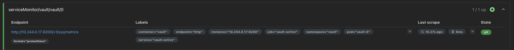
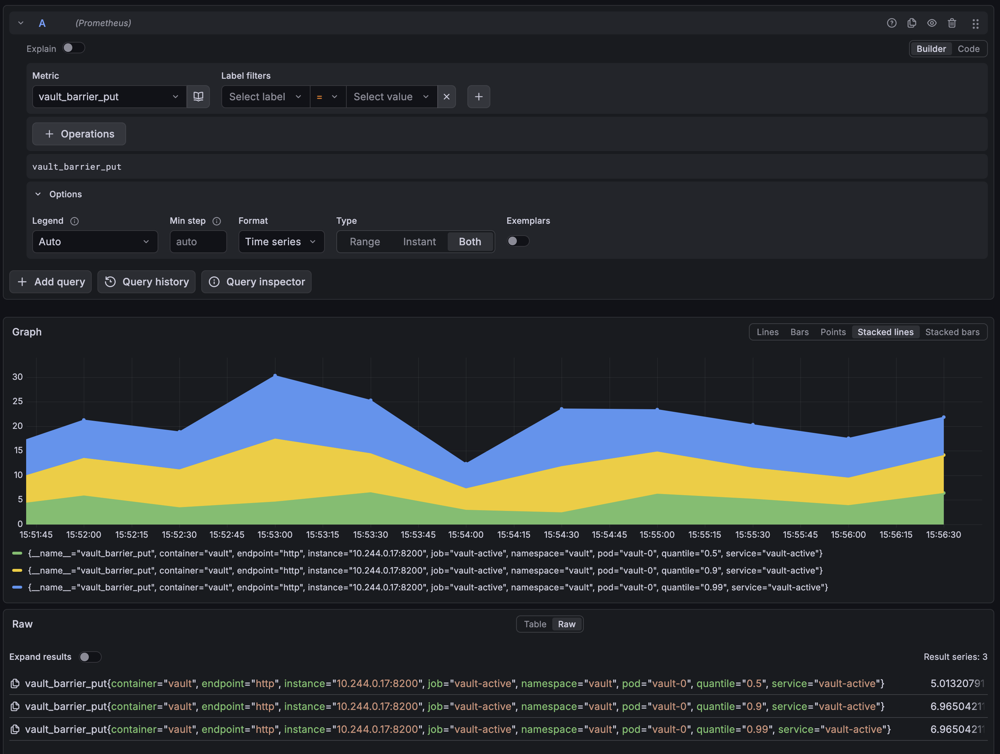
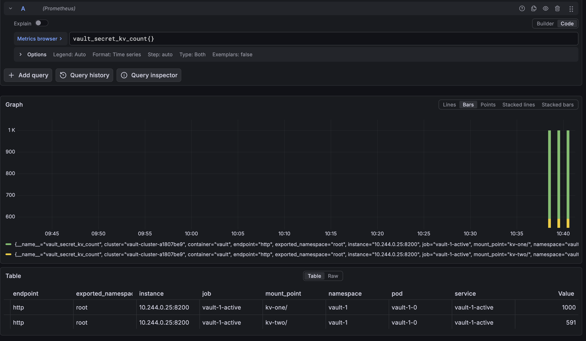

# Vault Telemetry with Local Prometheus + Grafana (Kubernetes)

## Overview

This runbook configures Vault telemetry metrics and visualizes them locally with Grafana.

You will:

1. Enable Vault Prometheus metrics.
2. Install `kube-prometheus-stack` (Prometheus + Grafana) in your local cluster.
3. Scrape Vault metrics with a `ServiceMonitor`.
4. Verify telemetry in Prometheus and Grafana.

## Prerequisites

- A running local Kubernetes cluster (for example, minikube)
- A running Vault Helm release in namespace `vault`
- `kubectl`, `helm`, and `jq`

If needed, bootstrap Vault with:

```bash
./setup/init.sh
```

## 1) Install Prometheus and Grafana locally

```bash
helm repo add prometheus-community https://prometheus-community.github.io/helm-charts
helm repo update

kubectl create namespace monitoring 2>/dev/null || true

helm upgrade --install kube-prometheus-stack prometheus-community/kube-prometheus-stack \
  -n monitoring \
  --set prometheus.prometheusSpec.serviceMonitorSelectorNilUsesHelmValues=false \
  --wait --timeout 10m
```

Results:
```bash
k get pods -n monitoring
NAME                                                        READY   STATUS    RESTARTS   AGE
alertmanager-kube-prometheus-stack-alertmanager-0           2/2     Running   0          96s
kube-prometheus-stack-grafana-586dbcbb64-vp4cv              3/3     Running   0          111s
kube-prometheus-stack-kube-state-metrics-786c9f6658-jjvcz   1/1     Running   0          111s
kube-prometheus-stack-operator-64977f4ccd-hzbnm             1/1     Running   0          111s
kube-prometheus-stack-prometheus-node-exporter-dkjj4        1/1     Running   0          111s
prometheus-kube-prometheus-stack-prometheus-0               2/2     Running   0          96s
```

Why the selector setting matters:

- `serviceMonitorSelectorNilUsesHelmValues=false` allows Prometheus to discover ServiceMonitors outside only-this-release labels, which is useful for scraping Vault's ServiceMonitor.

## 2) Enable Vault telemetry and ServiceMonitor

Create a values file:

```bash
cat <<'EOF' > kubernetes/vault-telemetry-values.yaml
server:
  ha:
    config: |
      ui = true
      listener "tcp" {
        tls_disable = 1
        address = "[::]:8200"
        cluster_address = "[::]:8201"
        telemetry {
          unauthenticated_metrics_access = "true"
        }
      }
      storage "raft" {
        path = "/vault/data"
      }
      service_registration "kubernetes" {}
      telemetry {
        prometheus_retention_time = "30s"
        usage_gauge_period = "1m"
        disable_hostname = true
      }

serverTelemetry:
  serviceMonitor:
    enabled: true
    interval: 15s
    scrapeTimeout: 10s
EOF
```

Apply the values:

```bash
helm upgrade vault hashicorp/vault \
  -n vault \
  --reuse-values \
  -f kubernetes/vault-telemetry-values.yaml
```

If Vault pods restart after this upgrade, re-initialize runtime state before telemetry checks:

1. Re-unseal all Vault pods.
2. Log back into Vault (for example, with your root or admin token).

Telemetry metrics should be available after pods are unsealed and Vault is operational again.

## 3) Verify Vault metrics endpoint

Check from inside a Vault pod:

```bash
kubectl exec -n vault vault-0 -- sh -lc \
  'wget -qO- http://127.0.0.1:8200/v1/sys/metrics?format=prometheus | sed -n "1,20p"'
```

You should see Prometheus-format metrics (lines beginning with `# HELP`, `# TYPE`, and metric names).

## 4) Verify Prometheus is scraping Vault

Check that Vault ServiceMonitor exists:

```bash
kubectl get servicemonitor -A | grep -i vault
NAMESPACE    NAME                                             AGE
vault        vault                                            6m40s
```

Port-forward Prometheus UI:

```bash
kubectl -n monitoring port-forward svc/kube-prometheus-stack-prometheus 9090:9090
```

Then open:

- http://localhost:9090/targets

Look for a target related to Vault and confirm state is `UP`.

_Screenshot: Prometheus `/targets` view confirming Vault is up._

## 5) Access local Grafana

In a separate terminal, port-forward Grafana:

```bash
kubectl -n monitoring port-forward svc/kube-prometheus-stack-grafana 3000:80
```

Get Grafana admin password:

```bash
kubectl get secret -n monitoring kube-prometheus-stack-grafana \
  -o jsonpath='{.data.admin-password}' | base64 --decode; echo
```

Login details:

- URL: http://localhost:3000
- Username: `admin`
- Password: command output above

## 6) Quick telemetry checks in Grafana

Use **Explore** and run queries like:

- `up{namespace="vault"}`
- `vault_core_unsealed`
- `vault_runtime_alloc_bytes`
- `vault_barrier_put`

If data returns for these queries, Vault telemetry is wired correctly.


_Screenshot: Prometheus dashboard graph showing `vault_barrier_put` for the last 5 minutes._

## 7) (Optional) Seed KV data to validate secret counts

Use this step to create known counts so you can validate the KV count telemetry quickly. Referencing secret count by namespace/mount is a common question in support as many customers want to keep track of their secret sprawl and storage usage. 

```bash
kubectl exec -n vault vault-0 -- sh -lc '
for i in $(seq 1 1000); do
  key=$(printf "secret-%04d" "$i")
  vault kv put "kv-one/$key" value="v-$i" >/dev/null
done

for i in $(seq 1 591); do
  key=$(printf "secret-%04d" "$i")
  vault kv put "kv-two/$key" value="v-$i" >/dev/null
done
'
```

Run these checks to confirm the seeded counts:

```bash
kubectl exec -n vault vault-0 -- sh -lc 'vault kv list -format=json kv-one | jq "length"'
kubectl exec -n vault vault-0 -- sh -lc 'vault kv list -format=json kv-two | jq "length"'
```

Expected output:

```bash
1000
591
```

## 8) View KV secret count metrics in Grafana

Use Grafana Explore with Prometheus data source to find all KV secret count series.

```bash
vault_secret_kv_count
```

If you want grouped totals by namespace and mount, use:

```bash
sum by (namespace, mount_point) (vault_secret_kv_count)
```

Success criteria:

- You see one series per KV mount/namespace combination.
- The values match your expected key counts (for example `1000` and `591` in this repro).


_Screenshot: Grafana Explore showing `vault_secret_kv_count` values for KV mounts._

## 9) Import Vault dashboards from this repro

- `telemetry/dashboards/core.json`
- `telemetry/dashboards/storage.json`
- `telemetry/dashboards/leases.json`

In Grafana:

1. Go to **Dashboards** -> **New** -> **Import**.
2. Upload each JSON file above.
3. Select your Prometheus data source when prompted.

## Cleanup (optional)

```bash
helm uninstall kube-prometheus-stack -n monitoring
kubectl delete namespace monitoring
```

